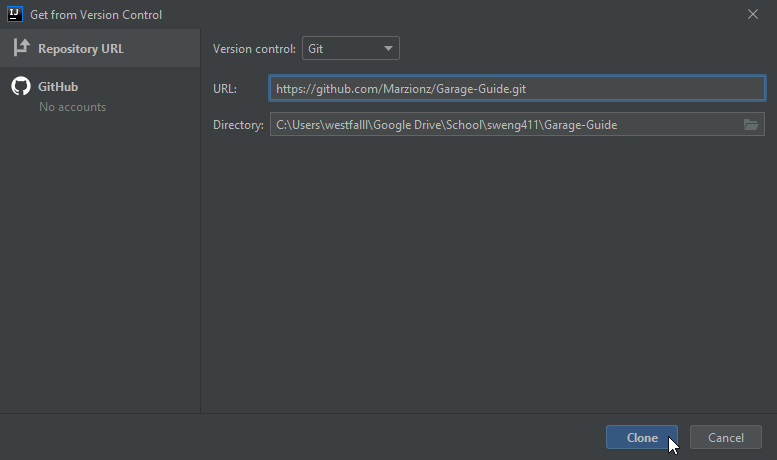

# Developer Guide

Here are some basic instructions on how to get started with development for GarageGuide.
These instructions are written for IntelliJ, they will vary a bit from other IDEs.
Let's use this document to help, uh, document anything related to our development environments and notes about working in Git.

## Install Node.js and NPM

1. [Download](https://nodejs.org/en/) and install Node.js if you don't already have it.
2. After installation, verify npm is properly installed by opening a command prompt and typing `npm -v`. It should print the npm version.

## Local Repo Setup

If you don't have git installed, download and install it from [here](https://git-scm.com/download) first.

Clone the repository using IntelliJ's interface (URL is `https://github.com/Marzionz/Garage-Guide.git`):




Once this is complete, IntelliJ should automatically open the cloned project.

## Configure IntelliJ Run/Debug

1. In IntelliJ, open src/main/java/com.TeamOne411/Application.java.
2. Click the green arrow to the left of the `main()` method.
3. You should see the project build. It will run `npm install` for you which will probably take several minutes. This command will only run the first time and any time we add npm packages, so subsequent builds should take a fraction of the time. When it's done you should see this: 

    > 2020-09-16 12:20:32.551  INFO 40864 --- [  restartedMain] com.TeamOne411.Application               : Started Application in 8.962 seconds (JVM running for 9.517)

4. Once you see the above text, try opening a browser (anything except internet explorer...) and browse to <http://localhost:8080>
   
   You should see a "Hello World" button in the upper left corner and an install button at the bottom of the page.
   
   If you see these, you should be all set.
   
   
   
   

**Note:** from now on you should be able to click the green arrow in the upper right of the window or hit `Shift+F10` to rebuild and run, rather than from Application.java.
   
## Using Git

If you're at all unfamiliar with Git, I strongly recommend checking out some youtube tutorials or websites. Here are some tips of my own:

- Never work directly on master. Start a new branch to work on features or bugs. Don't forget to checkout the new branch. Eg:
    ```
    git branch new-feature
    git checkout new-feature
    ```
    (change "new-feature" to whatever the name of your branch is)
    
    When you want to push your new branch (presumably after you've made commits), you'll have to run this (only on the first push for that branch):
    ```
    git push --set-upstream origin new-feature
    ```
    (change "new-feature" to whatever the name of your branch is)
- Never force push `git push --force`. If you get errors trying to push, something's wrong. It can probably be fixed with `git pull` if someone else has pushed since your last fetch/pull.
- Avoid doing a ton of unrelated work in a single commit, try to make one commit touch only a single bug or feature at a time.
    If you touched a few different things that's okay. When staging your changes before you commit and you want to split into multiple commits, use `git add -p` instead of `git add .` or similar.
    This allows you to select which hunks of code get staged for the next commit. I do this pretty much all the time.
- Always include commit messages, eg: 

    `git commit -m "This is a commit message, I did xyz"`
    
    If you want to be more detailed with your messages, try:
    
    `git commit -m "This is a commit message, it should be short" -m "Here are more details about this commit, this can be longer" -m "I can do this as many times as I want to add more lines to the message."`
- If you're a git beginner, I guarantee you'll get frustrated and confused at times. There is a learning curve. Reach out in discord if you get stuck.
